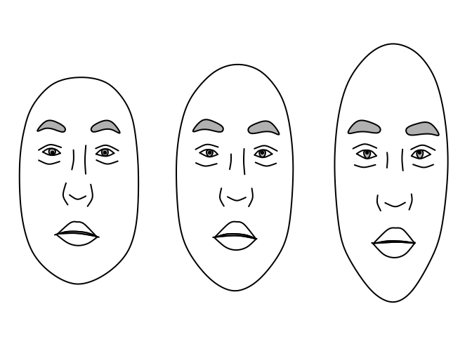
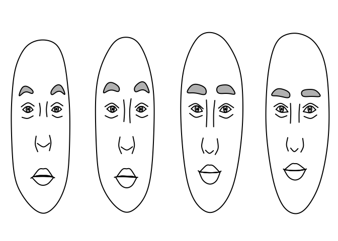

## Overview

Parametric Face Drawings (PFD; Day and Davidenko, 2019) are schematic,
though realistic, parameterized line drawings of faces based on the
statistical distribution of human facial feature. Principal components
analysis applied to a set of 400 landmarks manually placed on a
demographically diverse sample yields a “face space” that can be used
for face modeling applications. This R package is a partial port of the
Matlab code of Day and Davidenko hosted at the Open Science Framework:
<https://osf.io/6uds5/>

Below we demonstrate some of the basic features of the R package.

### Generate and plot a random face from a demographically diverse face space

``` r
library(pcfacespace)
face <- pcfacespace::gen_face()
plot(pfd_splines(face))
```

<!-- -->

### Morph two random faces

``` r
normcoef <- function(x, type="F") {
  x/norm(as.matrix(x), "F")
}

orthogonalize <- function(x,y) {
  y2 = y - ((x %*% y)/(x %*% x))[1,1] * x
}

degtorad <- function(deg) {
  rad <- pi/180 * deg
  rad
}

radtodeg <- function(rad) {
  rad * 180/pi
}

antimorph <- function(x,y, degree=10) {
  x <- normcoef(x)
  y <- normcoef(y)
  
  rad <- pi/180 * degree
  b <- rad/degtorad(45)
  delta <- x-y
  delta <- normcoef(delta)
  
  #bvals = seq(0,1,by=.01)
  #out <- sapply(bvals, function(b) {
  #  acos(x %*% normcoef(delta*b + (1-b)*x))
  #})
  
  normcoef(delta*b + (1-b)*x)

}


distinctiveness <- 10

## generate 166 normally distributed principal component coefficients for face 1
face1 <- normcoef(rnorm(57))
## generate 166 normally distributed principal component coefficients for face 2
face2 <- normcoef(rnorm(57))
face2 <- orthogonalize(face1,face2)
face2 <- normcoef(face2)

## create a "spline" representation of face1, face2, and the average of face1 and face2 (the morph).
f1 <- pfd_splines(gen_face(coef=face1*distinctiveness))
f2 <- pfd_splines(gen_face(coef=face2*distinctiveness))
f3 <- pfd_splines(gen_face(coef=normcoef(face1+face2)*distinctiveness))

grid.newpage()

multiplot(list(f1,f3,f2), nrow=1, ncol=3)
```

<!-- -->

### Push two faces away from each other in PC-space using a “face difference”

``` r
dval  <- 6
## set number of components (all pcs > 60 will be set to zero)
ncomp <- 60
## generate `ncomp` normally distributed principal component coefficients for face 1
face1 <- normcoef(rnorm(60)) 
## generate `ncomp` normally distributed principal component coefficients for face 2
face2 <- normcoef(rnorm(60))

## make face1 and face2 orthogonal
face2 <- orthogonalize(face1, face2)
## renormalize
face2 <- normcoef(face2)
print(face1 %*% face2)
#>              [,1]
#> [1,] 3.122502e-17

## move face1 40 degrees away from face2
antiface1 <- antimorph(face1, face2, degree=40)
## move face2 40 degrees away from face1
antiface2 <- antimorph(face2, face1, degree=40)

grid.newpage()
multiplot(list(pfd_splines(gen_face(coef=antiface1*dval)),
               pfd_splines(gen_face(coef=face1*dval)),
               pfd_splines(gen_face(coef=face2*dval)),
               pfd_splines(gen_face(coef=antiface2*dval))),
               nrow=1, ncol=4)
```

<!-- -->

## References

Day, J., & Davidenko, N. (2019). Parametric face drawings: A
demographically diverse and customizable face space model. Journal of
vision, 19(11), 7-7.
