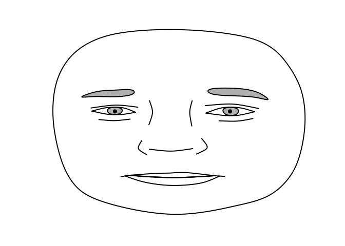
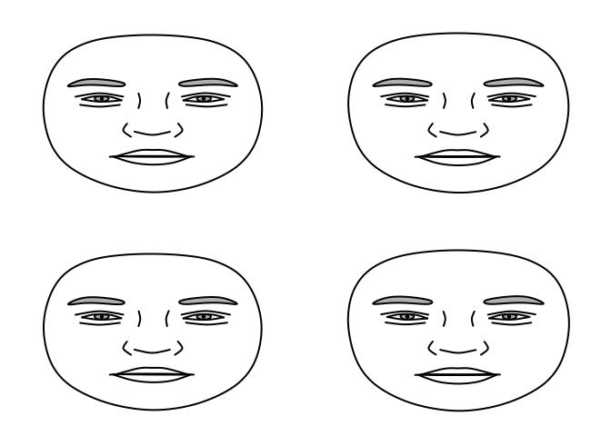
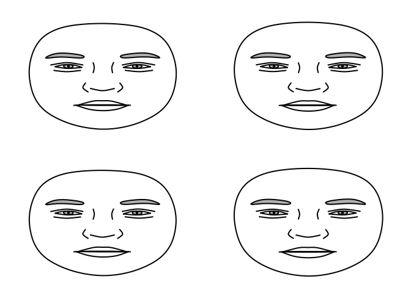

## Overview

Parametric Face Drawings (PFD; Day and Davidenko, 2019) are schematic,
though realistic, parameterized line drawings of faces based on the
statistical distribution of human facial feature. Principal components
analysis applied to a set of 400 landmarks manually placed on a
demographically diverse sample yields a “face space” that can be used
for face modeling applications. This R package is a partial port of the
Matlab code of Day and Davidenko hosted here at the Open Science
Framework: <https://osf.io/6uds5/>

Below we demonstrate some of the basic features of the R package.

### Generate and plot a random face from a demographically diverse face space

``` r
library(pcfacespace)
face <- pcfacespace::gen_face()
plot(pfd_splines(face))
```

<!-- -->

### Morph two random faces

``` r


## generate 166 normally distributed princpal component coefficients for face 1
face1 <- rnorm(166)
## generate 166 normally distributed princpal component coefficients for face 2
face2 <- rnorm(166)

## create a "spline" represenation of face1, face2, and the average of face1 and face2 (the morph).
f1 <- pfd_splines(gen_face(coef=face1))
f2 <- pfd_splines(gen_face(coef=face2))
f3 <- pfd_splines(gen_face(coef=scale((face1+face2)/2)[,1]))

multiplot(list(f1,f2,f3), nrow=1, ncol=3)
```

<!-- -->

### Push two faces away from each other in PC-space using a “face difference”

``` r


## generate 166 normally distributed princpal component coefficients for face 1
face1 <- rnorm(166)
## generate 166 normally distributed princpal component coefficients for face 2
face2 <- rnorm(166)

## create a "face difference" vector
delta <- scale(face1 - face2)[,1]

## push the first face away from the second face by 1 difference units.
delta_face1 = pcfacespace::gen_face(delta + face1)

## push the second face away from the first face by 1 difference units (notice the sign reversal).
delta_face2 = pcfacespace::gen_face(-delta + face2)

multiplot(list(pfd_splines(gen_face(coef=face1)),pfd_splines(gen_face(coef=face2)),
               pfd_splines(delta_face1),pfd_splines(delta_face2)), nrow=2, ncol=2)
```

<!-- -->

``` r

## push the first face away from the second face by .5 difference units.
delta_face1 = pcfacespace::gen_face(.5*delta + face1)

## push the second face away from the first face by .5 difference units (notice the sign reversal).
delta_face2 = pcfacespace::gen_face(-.5*delta + face2)

multiplot(list(pfd_splines(gen_face(coef=face1)),pfd_splines(gen_face(coef=face2)),
               pfd_splines(delta_face1),pfd_splines(delta_face2)), nrow=2, ncol=2)
```

<!-- -->

``` r

## push the first face away from the second face by .3 difference units.
delta_face1 = pcfacespace::gen_face(.3*delta + face1)

## push the second face away from the first face by .3 difference units (notice the sign reversal).
delta_face2 = pcfacespace::gen_face(-.3*delta + face2)

multiplot(list(pfd_splines(gen_face(coef=face1)),pfd_splines(gen_face(coef=face2)),
               pfd_splines(delta_face1),pfd_splines(delta_face2)), nrow=2, ncol=2)
```

<!-- -->
